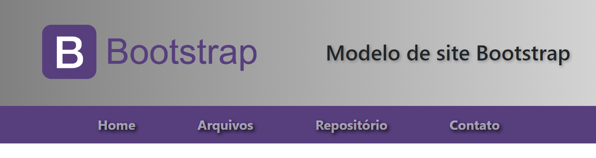
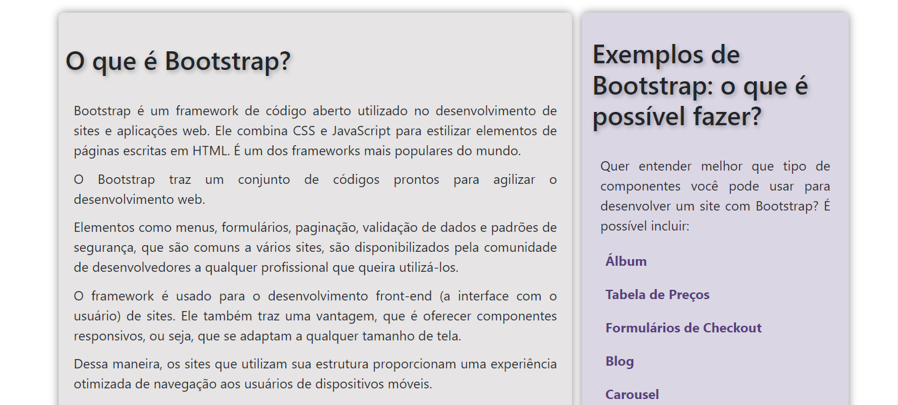
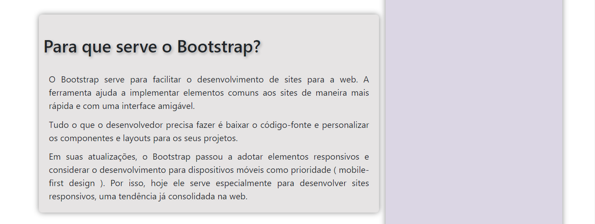
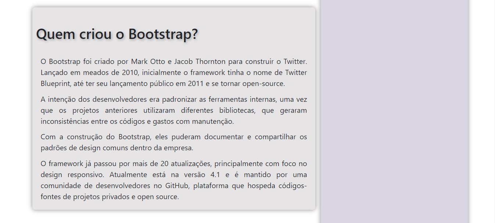

# SITE BOOTSTRAP
👨‍🏫PROJETO FEITO PARA O CURSO DE BOOTSTRAP.

  
  
  
  
  

## DESCRIÇÃO:
Este é um código HTML que utiliza o framework Bootstrap para criar uma página da web responsiva sobre o Bootstrap. Aqui estão as principais partes do código:

### HTML (`INDEX.html`):
1. **Meta Tags e Título:**
   - Define o conjunto de caracteres, a viewport e o título da página como "Projeto Página Bootstrap".

2. **Vinculação de Estilos e Scripts:**
   - Vincula o arquivo CSS do Bootstrap e um ícone para a aba do navegador (`imagens/kindpng_2258787.png`).
   - Inclui um estilo embutido no HTML para ajustes específicos.

3. **Cabeçalho (`<header>`):**
   - Inclui uma imagem de banner e um título centrado.

4. **Navegação (`<nav>`):**
   - Usa a barra de navegação do Bootstrap, personalizando as cores e os estilos dos itens de menu.

5. **Conteúdo Principal (`<main>`):**
   - Divide a área principal em duas seções (`<section>` e `<aside>`).
   - A seção principal (`<section>`) contém vários artigos sobre o Bootstrap, destacando suas características, finalidades, criadores e como começar a usá-lo.
   - A barra lateral (`<aside>`) lista exemplos de componentes do Bootstrap, como álbum, tabela de preços, formulários de checkout, etc.

6. **Rodapé (`<footer>`):**
   - Contém informações sobre o criador da página com um link para o perfil do GitHub.

7. **Scripts JavaScript:**
   - Inclui scripts JavaScript embutidos para alterar as cores dos links na barra lateral quando o mouse passa sobre eles.

8. **Scripts do Bootstrap:**
   - Inclui os scripts do Bootstrap (JavaScript) e o arquivo `bootstrap.min.css` do CDN.

### CSS:
1. **Estilos Gerais:**
   - Define estilos para a imagem (`img`) e para o cabeçalho (`header`).
   - Usa gradientes e sombras para estilizar o cabeçalho.
   - Personaliza as cores e estilos da barra de navegação (`nav`).
   - Estiliza os artigos (`article`), a barra lateral (`aside`), e o rodapé (`footer`).

### JS:
1. **Funções JavaScript:**
   - Duas funções (`marcar` e `desmarcar`) alteram as cores dos links na barra lateral quando o mouse passa sobre eles e quando sai.

### BOOTSTRAP:
   - O código utiliza a versão 5.2.0-beta1 do Bootstrap, incluindo a folha de estilos (`bootstrap.min.css`) e os scripts (`bootstrap.bundle.min.js`) do CDN.

### CONSIDERAÇÕES ADICIONAIS:
   - A página é responsiva, pois utiliza o framework Bootstrap, que é conhecido por fornecer elementos responsivos e facilitar o desenvolvimento web.
   - As cores, sombras e estilos utilizados criam uma estética visual agradável.
   - Há ênfase na utilização de gradientes e sombras para melhorar a aparência da página.
   - A interatividade na barra lateral ao passar o mouse sobre os links é implementada com JavaScript embutido.
   - Informações sobre o criador da página e um link para o GitHub são incluídos no rodapé.

## NÃO SABE?
- Entendemos que para manipular arquivos em `HTML`, `CSS` e outras linguagens relacionadas, é necessário possuir conhecimento nessas áreas. Para auxiliar nesse aprendizado, oferecemos cursos gratuitos disponíveis:
* [CURSO DE HTML E CSS](https://github.com/VILHALVA/CURSO-DE-HTML-E-CSS)
* [CURSO DE JAVASCRIPT](https://github.com/VILHALVA/CURSO-DE-JAVASCRIPT)
* [CURSO DE BOOTSTRAP](https://github.com/VILHALVA/CURSO-DE-BOOTSTRAP)
* [CONFIRA MAIS CURSOS](https://github.com/VILHALVA?tab=repositories&q=+topic:CURSO)

## CREDITOS:
- [PROJETO FEITO PELO VILHALVA](https://github.com/VILHALVA)
- [PROJETO FEITO PARA O CURSO DE BOOTSTRAP](https://github.com/VILHALVA/CURSO-DE-BOOTSTRAP)
